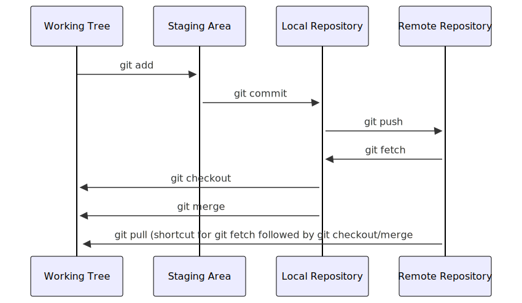

## Introduction

Version control systems are a way to keep track of changes in text-based documents. We start with a base version of the document and then record the changes you make each step of the way. You can think of it as a recording of your progress: you can rewind to start at the base document and play back each change you made, eventually arriving at your more recent version.

The git version control system, used to manage the code in many millions of software projects, is one of the most widely adopted one. It uses a distributed version control model (the "beautiful graph theory tree model"), meaning that there is no single central repository of code. Instead, users share code back and forth to synchronise their repositories, and it is up to each project to define processes and procedures for managing the flow of changes into a stable software product.

## Challenges

Git is powerful and flexible to fit a wide range of use cases and workflows from simple projects written by a single contributor to projects that are millions of lines and have hundreds of co-authors. Furthermore, it does a task that is quite complex. As a result, many users may find it challenging to navigate this complexity. While committing and sharing changes is fairly straightforward, for instance, but recovering from situations such as accidental commits, pushes or bad merges is difficult without a solid understanding of the rather large and complex conceptual model. Case in point, three of the top five highest voted questions on Stack Overflow are questions about how to carry out relatively simple tasks: undoing the last commit, changing the last commit message, and deleting a remote branch.

Mouse-over text: If that doesn't fix it, git.txt contains the phone number of a friend of mine who understands git. Just wait through a few minutes of 'It's really pretty simple, just think of branches as...' and eventually you'll learn the commands that will fix everything.

With this lesson our goal is to give a you a more in-depth understanding of the conceptual model of git, to guide you through increasingly complex workflows and to give you the confidence to participate in larger projects.

## Review of Intro Git Commands

First, lets review the concepts and commands that constitute the basic git workflow.

~~~
git init
~~~
{: .language-bash}

~~~
git add file.txt
git commit -m "Message"
~~~
{: .language-bash}

A commit, or "revision", is an individual change to a file or set of files. It's like when you save a file, except with `git`, every time you save it creates a unique ID (a.k.a. the "SHA" or "hash") that allows you to keep record of what changes were made when and by who. Each commit contains several key pieces of information that uniquely define its state:

- **Commit message**: A description provided by the user explaining the purpose or details of the commit.

- **Committer**: The person who added the commit to the repository.

- **Commit date**: The date and time when the commit was added to the repository.

- **Author**: The original creator of the changes in the commit, which may differ from the committer.

- **Authoring date**: The date and time when the changes were originally made by the author.

- **Parent commit(s)**: Reference to the previous commit(s), which allows Git to trace the history and create a chain of commits.

- **Working directory hash**: A unique hash representing the state of all tracked files in the working directory at the time of the commit.

All these elements together generate a unique **commit hash**, which identifies the commit across the Git repository.

~~~
git log
git status
git diff
git checkout HEAD file.txt
git revert
~~~
{: .language-bash}

`git checkout` returns the files not yet committed within the local repository to a previous state, whereas `git revert` reverses changes committed to the local and project repositories.

~~~
git clone http://....
~~~
{: .language-bash}

~~~
git push
~~~
{: .language-bash}

~~~
git pull
~~~
{: .language-bash}

Finally, the `git fetch` command downloads commits, files, and refs from a remote repository into your local repo. When downloading content from a remote repo, `git pull` and `git fetch` commands are available to accomplish the task. You can consider git fetch the 'safe' version of the two commands. It will download the remote content but not update your local repo's working state, leaving your current work intact. `git pull` is the more aggressive alternative; it will download the remote content for the active local branch and immediately execute `git merge` to create a merge commit for the new remote content. If you have pending changes in progress this will cause conflicts and kick-off the merge conflict resolution flow. The following command will bring down __all__ the changes from the remote:

~~~
git fetch
~~~
{: .language-bash}

It is sometimes useful to only pull the changes from a certain branch, e.g., `main`. For a repository that has a lot of contributors and branches, all the changes may be unnecessary and overwhelming:

~~~
git fetch origin main
~~~
{: .language-bash}

https://www.atlassian.com/git/tutorials/syncing/git-fetch

[comment]: <> ()

## Git Refresher

Git is a version control system for tracking changes in computer files
and coordinating work on those files among multiple people.
It is primarily used for source code management in software development
but it can be used to track changes in files in general -
it is particularly effective for tracking text-based files
(e.g. source code files, CSV, Markdown, HTML, CSS, Tex, etc. files).

Git has several important characteristics:

- support for non-linear development
  allowing you and your colleagues to work on different parts of a project concurrently,
- support for distributed development
  allowing for multiple people to be working on the same project
  (even the same file) at the same time,
- every change recorded by Git remains part of the project history
  and can be retrieved at a later date,
  so even if you make a mistake you can revert to a point before it.

The diagram below shows a typical software development lifecycle with Git
(in our case starting from making changes in a local branch that "tracks" a remote branch) and the commonly used commands to interact
with different parts of the Git infrastructure, including:

- **working tree** -
  a local directory (including any subdirectories) where your project files live
  and where you are currently working.
  It is also known as the "untracked" area of Git or "working directory".
  Any changes to files will be marked by Git in the working tree.
  If you make changes to the working tree and do not explicitly tell Git to save them -
  you will likely lose those changes.
  Using `git add filename` command,
  you tell Git to start tracking changes to file `filename` within your working tree.
- **staging area (index)** -
  once you tell Git to start tracking changes to files
  (with `git add filename` command),
  Git saves those changes in the staging area on your local machine.
  Each subsequent change to the same file needs to be followed by another `git add filename` command
  to tell Git to update it in the staging area.
  To see what is in your working tree and staging area at any moment
  (i.e. what changes is Git tracking),
  run the command `git status`.
- **local repository** -
  stored within the `.git` working tree of your project locally,
  this is where Git wraps together all your changes from the staging area
  and puts them using the `git commit` command.
  Each commit is a new, permanent snapshot (checkpoint, record) of your project in time,
  which you can share or revert to.
- **remote repository** -
  this is a version of your project that is hosted somewhere on the Internet
  (e.g., on GitHub, GitLab or somewhere else).
  While your project is nicely version-controlled in your local repository,
  and you have snapshots of its versions from the past,
  if your machine crashes - you still may lose all your work. Furthermore, you cannot
  share or collaborate on this local work with others easily.
  Working with a remote repository involves pushing your local changes remotely
  (using `git push`) and pulling other people's changes from a remote repository to
  your local copy (using `git fetch` or `git pull`) to keep the two in sync
  in order to collaborate (with a bonus that your work also gets backed up to another machine).
  Note that a common best practice when collaborating with others on a shared repository
  is to always do a `git pull` before a `git push`, to ensure you have any latest changes before you push your own.

<!--
Created with https://mermaid.live/edit#pako:eNqVUsFOwzAM_ZXIJxBldK3aZjlMQsANLhsSEuolNF5brU1KmgjKtH8nbRlsTEPCJ9t5L-9Z9gYyJRAYtPhqUWZ4W_Jc8zqVxMWT0utS5uRRI17O5xdLw_O-vtbIGclLQ7gQI3T_qYfeq4xXZIGNakujdDfCM1XXpRkZvxE9a4G1MnhEa2xbjKQjwGmtFZqsOC21PxsbvBWYrZU1_6DUqHP8w9gB4WuSqiJnbaG0yazzqPSPV1dVlXpDQV46su_oatA5Bw9cUvNSuH1tetkUTIE1psBcKnDFbWVSSOXWQbk1atnJDJjRFj2wjeBmt15gK161rouiN_sw3sBwCh5oZfPiG9Fw-axUffjN3UDb9XLdWxpzjVKgvlFWGmDxdOAD28A7sIhGkygJ_Wjm08APp4EHHbAknszCJAoCSumUhvHWg49Bz5_QJPJdRGEYz5IkpttPWWLlPg

sequenceDiagram
    Working Tree->>+Staging Area: git add
    Staging Area->>+Local Repository: git commit
    Local Repository->>+Remote Repository: git push
    Remote Repository->>+Local Repository: git fetch
    Local Repository->>+Working Tree:git checkout
    Local Repository->>+Working Tree:git merge
    Remote Repository->>+Working Tree: git pull (shortcut for git fetch followed by git checkout/merge)
-->

<!--
SVG of the diagram can be downloaded from:
https://mermaid.ink/svg/pako:eNqFksFuwyAMhl8FcemmdS_AodKm7rZe2sOkKRcXnAQNcEaMpqjquw-SZZtUReEE9vfbP5iL1GRQKtnjZ8KgcW-hieCrIPJ6o_hhQyP2NqJmisPjbvdwYmhK8CkiKNFYFmDMxP9PFfSVNDhxxI56W-TiOULQ7aTS5L3lSbgAlhpH9MS4VKRLfTuVWOJWfdTIul21cfMUqmg9xgbX-9-Kf8w7J-76liLrlI1Q_DOUT87RFxpxHsRvq5EBseEIeqx4Hnts7uVWZsCDNXmWl-Koktyix0qqvDVYQ3JcySpcMwqJ6TQELRXHhFuZOgM8j16qGlyfo2jKPQ7T_xi_yUy-jJlZ3UF4J5p112_HVM9r
-->

{alt='Development lifecycle with Git, containing Git commands add, commit, push, fetch, restore, merge and pull' .image-with-shadow width="600px"}


