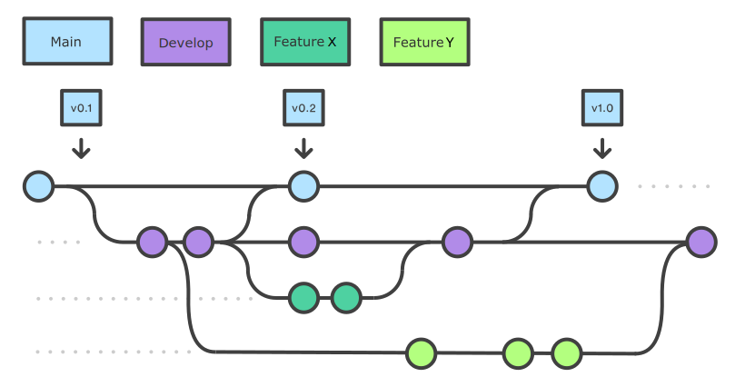
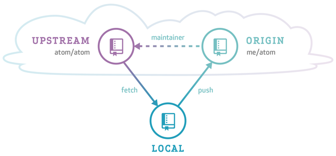

## What is a branching model/strategy?

Branches are primarily used as a means for teams to develop features giving them a separate workspace for their code. These branches are usually merged back to a main branch upon completion of work. (You may come across the term 'master', rather than 'main'. This used to be the usual term, but is now gradually becoming less common.) In this way, features (and any bug and bug fixes) are kept apart from each other allowing you to fix mistakes more easily.

This means that branches protect the mainline of code and any changes made to any given branch don’t affect other developers.

A branching strategy, therefore, is the strategy that software development teams adopt when writing, merging and deploying code when using a version control system.

It is essentially a set of rules that developers can follow to stipulate how they interact with a shared codebase.

Such a strategy is necessary as it helps keep repositories organized to avoid errors in the application and the dreaded merge hell when multiple developers are working simultaneously and are all adding their changes at the same time. Such merge conflicts would eventually deter the combination of contributions from multiple developers.

Thus, adhering to a branching strategy will help solve this issue so that developers can work together without stepping on each other’s toes. In other words, it enables teams to work in parallel to achieve faster releases and fewer conflicts by creating a clear process when making changes to source control.

When we talk about branches, we are referring to independent lines of code that branch off the main branch, allowing developers to work independently before merging their changes back to the code base.

In this and the following episodes, we will outline some of the branching strategies that teams use in order to organize their workflow where we will look at their pros and cons and which strategy you should choose based on your needs, objectives and your team’s capabilities.

## Why do you need a branching model?

As mentioned above, having a branching model is necessary to avoid conflicts when merging and to allow for the easier integration of changes into the main trunk.

A BRANCHING MODEL AIMS TO:
- Enhance productivity by ensuring proper coordination among developers
- Enable parallel development
- Help organize a series of planned, structured releases
- Map a clear path when making changes to software through to production
- Maintain a bug-free code where developers can quickly fix issues and get these changes back to production without disrupting the development workflow

## Git Branching Models

Some version control systems are Very Opinionated about the branching models that can be used. `git` is very much (fortunately or unfortunately) not. This means that there are many different ways to do development in a team and the team needs to explicitly agree on how and when to merge contributions to the main branch. So the first rule of `git` branching is: "Talk about your branching model." The second rule is: "Talk about your branching model." If in doubt, do what other people around you are doing. If they don't do anything, call a friend.

That said, there are a number of established (and less so) branching models that are used with `git`. These include, but are not limited to:

- **Centralized workflow**: enables all team members to make changes directly to the main branch. Every change is logged into the history. In this workflow, the contributors do not use other branches. Instead they all make changes on the main branch directly and commit to it. This works for individual developers or small teams which communicate very well, but can be tricky for larger teams: the code is in constant state of flux and developers keep changes local until they are ready to release.

- **Trunk-based development**: is somewhat similar to the centralized workflow. The development happens on a single branch called `trunk`. When changes need to be merged, each developer pulls and rebases from the trunk branch and resolves conflicts locally. This can work if small merges are made frequently and is more successful if there is CI/CD.

- **Feature branch workflow**: every small change or "feature" gets its own branch where the developers make changes. Once the feature is done, they submit a merge/pull request and merge it into the main branch. Features branches should be relatively short-lived. The benefit of this model is that the main branch is not poluted by unfinished features. Good for teams.

- **Gitflow**: is a model where the main development happens in a develop branch with feature branches. When the develop branch is ready for a release (or to go into production), a team member creates a release branch which is tested and eventually merged onto the dev and eventually main branch.

- **GitHub flow**: similar to the branching workflow. ([Further info](https://docs.github.com/en/get-started/quickstart/github-flow))

- **GitLab flow**: is a simplified version of Gitflow. ([Further info](https://about.gitlab.com/topics/version-control/what-is-gitlab-flow/))

- **Oneflow**: is similar to Gitflow but relies on the maintanance of one long-lived branch. It is meant to be simpler, without a develop branch but feature branches still exist.  ([Further info](https://www.endoflineblog.com/oneflow-a-git-branching-model-and-workflow))

- **Forking workflow** (e.g. astropy): is a model where each contributor creates a `fork` or a complete copy of the repository. Every contributor effectively has two repositories: his own and the main (upstream) one. Changes are made as pull requests against the main repository. This model is popular with open source projects because the vast majority of contributors do not need to have priviledges in the main repository.

A longer description of some of these can be found [here](https://about.gitlab.com/topics/version-control/what-is-git-workflow/#feature-branching-git-workflow).

In summary, there are many different ways to collaborate on a project. Look at the pros and cons and select one that fits the needs and organization of your team and project. In the following several sections we look at some of these models in more detail.

<!---  --->
<!---  --->

### Feature Branch Workflow

While it is technically OK to commit your changes directly to `main` branch,
and you may often find yourself doing so for some minor changes,
the best practice is to use a new branch for each separate and self-contained unit/piece of work
you want to add to the project.
This unit of work is also often called a *feature*
and the branch where you develop it is called a *feature branch*.
Each feature branch should have its own meaningful name -
indicating its purpose (e.g. "issue23-fix").
If we keep making changes and pushing them directly to the `main` branch on GitHub,
then anyone who downloads our software from there will get all of our work in progress -
whether or not it is ready to use!
So, working on a separate branch for each feature you are adding is good for several reasons:

- it enables the main branch to remain stable
  while you and the team explore and test the new code on a feature branch,
- it enables you to keep the untested and not-yet-functional feature branch code
  under version control and backed up,
- you and other team members may work on several features
  at the same time independently from one another, and
- if you decide that the feature is not working or is no longer needed -
  you can easily and safely discard that branch without affecting the rest of the code.

### Gitflow Workflow

In the Gitflow workflow,
we typically have a main branch which is the version of the code that is
tested, stable and reliable.
Then, we normally have a development branch
(called `develop` or `dev` by convention)
that we use for work-in-progress code.
As we work on adding new features to the code,
we create new feature branches that first get merged into `develop`
after a thorough testing process.
After even more testing - `develop` branch will get merged into `main`.
The points when feature branches are merged to `develop`,
and `develop` to `main`
depend entirely on the practice/strategy established in the team.
For example, for smaller projects
(e.g. if you are working alone on a project or in a very small team),
feature branches sometimes get directly merged into `main` upon testing,
skipping the `develop` branch step.
In other projects,
the merge into `main` happens only at the point of making a new software release.
Whichever is the case for you, a good rule of thumb is -
nothing that is broken should be in `main`.

An example is shown in the diagram below.

An example of Gitflow workflow 
Adapted from <a href="https://sillevl.gitbooks.io/git/content/collaboration/workflows/gitflow/" target="_blank">Git Tutorial by sillevl</a> (Creative Commons Attribution 4.0 International License)

### Forking Workflow

The forking workflow is popular among open source software projects and often used in conjunction with a branching model.

The focus of this workflow is to keep the "upstream main" stable while allowing anyone to work on their own contributions independently. Contributions are then suggested and accepted via pull requests. There is not necessarily a develop branch, but you may have release branches.

Source: GitHub 

In order to understand the forking workflow, let's first take a look at some special words and roles needed (we've already talked about some of these today!):

- ***upstream*** - Remote repository containing the "true copy"

- ***origin*** - Remote repository containing the forked copy

- **Pull request (PR)** - Merge request from fork to upstream (a request to add your suggestions to the "original copy")

- **Maintainer** - Someone with write access to upstream who vets PRs

- **Contributor** - Someone who contributes to upstream via PRs

- **Release manager** - A maintainer who also oversees releases

Here is some info about workflows used in a couple of projects as real life examples:

- [Example release workflow for the astropy Python package](https://docs.astropy.org/en/latest/development/maintainers/releasing.html)

- [Spacetelescope (STScI) style guide for release workflow](https://github.com/spacetelescope/style-guides/blob/master/guides/release-workflow.md)

>## Exercise 1: Suggest your changes via pull request
> Earlier in this workshop, you pushed a feature branch up to `origin` in which you had made a small change to `plot_buoys.py`.
> Go to your repository (your fork) on GitHub and find the tab called "Pull requests". Click the green "new pull request" button. Then find and click the blue link uder "Compare changes" called "compare across fork". Select your username and branch name from the right menus. Then click the big green button under the menus called "Create pull request".
{: .challenge}


